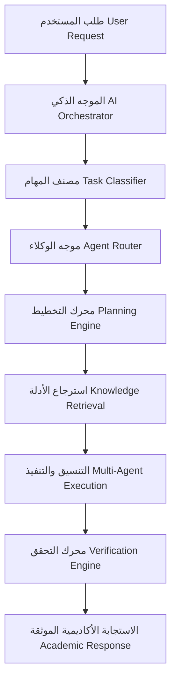

# طبقة الذكاء الاصطناعي المتعدد الوكلاء (ATHENA X AI ORCHESTRATOR & MULTI-AGENT LAYER)

## 1. الرؤية الهندسية (AI System Architecture)

تمثل طبقة الذكاء الاصطناعي في نظام **ATHENA X** الموجه المركزي والإطار التنفيذي لإدارة كافة العمليات المعرفية والأكاديمية والتحقيقية. تعتمد الطبقة على نمط **Multi-Agent Orchestration** لتفتيت المهام المركبة وتوزيعها على 15 وكيلاً أكاديمياً متخصصاً.

### تدفق المعالجة والأستجابة (Execution Architecture)

---

## 2. منظومة الوكلاء الأكاديميين (Agent Ecosystem)

تتضمن البيئة 15 وكيلاً متخصصاً يعملون بشكل فردي أو جماعي (تتابعي، متوازي، أو بنمط المشرف Supervisor Pattern):

1. **ResearchAgent**: البحث الأكاديمي الشامل واستكشاف المراجع والتراث.
2. **AcademicAgent**: التحرير الأكاديمي وصياغة الأطروحات المنهجية.
3. **BibleAgent**: التفسير اللاهوتي المقارن وقراءة النصوص باللغات الأصلية (اليونانية والعبرية).
4. **PatristicAgent**: دراسة أقوال وآباء الكنيسة ودراسات Patrologia Graeca / Latina.
5. **ChurchHistoryAgent**: توثيق المجالس والخطوط الزمنية والأحداث الكنسية.
6. **ManuscriptAgent**: دراسة المخطوطات والبرديات واختلافات النساخ (Paleography).
7. **OCRAgent**: معالجة وترميم نصوص التعتيم والخطوط القديمة بعد التعرف الضوئي.
8. **TranslationAgent**: الترجمة الأكاديمية المتخصصة بين اللغات القديمة والحديثة.
9. **LanguageAgent**: التحليل الصرفي واللغوي وجذور الكلمات للغات السامية.
10. **KnowledgeGraphAgent**: استخراج الكيانات والعلاقات وبناء الشبكة المعرفية.
11. **CitationAgent**: توليد التوثيق الأكاديمي الموحد وفق نظام Chicago/APA/MLA.
12. **ReviewerAgent**: محاكاة التحكيم الأكاديمي والنقد المنهجي لمراجعة المحتوى.
13. **FactCheckerAgent**: التدقيق التاريخي ومطابقة الادعاءات مع الأرشيف المعتمد.
14. **StudyPlannerAgent**: بناء خطط البحث والجداول الزمنية والمراحل الأكاديمية.
15. **WritingAgent**: التجميع وصياغة النثر الأكاديمي النهائي.

---

## 3. استراتيجية التشغيل المحلي (Offline & Local AI Strategy)

يدعم النظام 4 أنماط تشغيلية مرنة لضمان السيادة التامة للبيانات (Local-First sovereignty):

* **Offline Mode**: تشغيل محلي 100% عبر نماذج Ollama / Local LLM بون أي اتصال بالإنترنت.
* **Hybrid Mode**: معالجة المهام الخفيفة والخاصة محلياً واستخدام السحابة للمهام الاستدلالية المعقدة.
* **Cloud Mode**: الأداء الأقصى مع النماذج السحابية المتقدمة (Gemini / OpenAI / Claude).
* **Emergency Mode**: نمط طوارئ خفيف الاستهلاك للذاكرة والبطارية.

---

## 4. نموذج الأمان والسلامة (Security Model)

* **PromptSecurityValidator**: فحص إدخالات المستخدم والتعليمات ضد أنماط الحقن الضار (Prompt Injection).
* **ContextWindowManager**: تحجيم وتقليم سياق النصوص لعدم تجاوز سعة النافذة (Token Limit).
* **AnswerVerifier**: حساب نسبة الثقة والموثوقية الأكاديمية (Academic Reliability Score) لكل إجابة.
