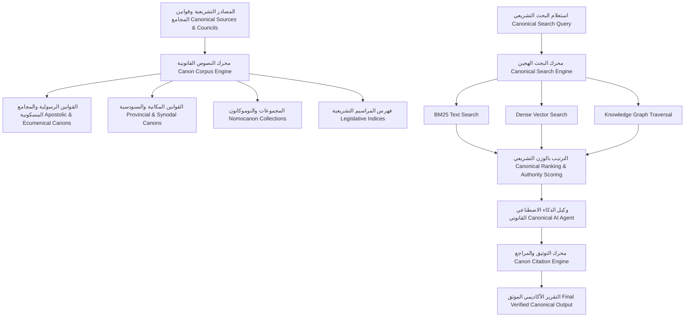
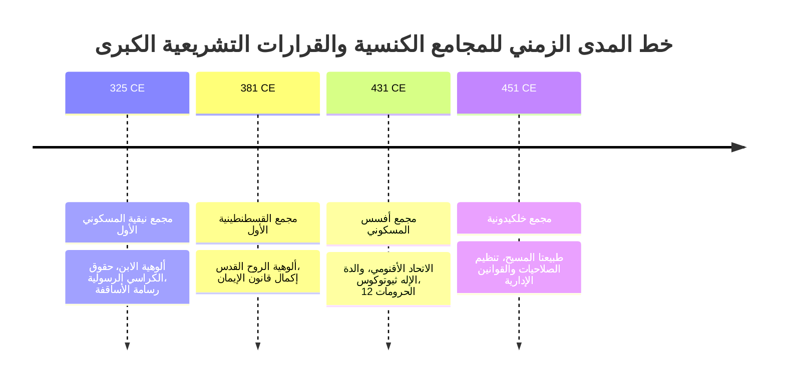
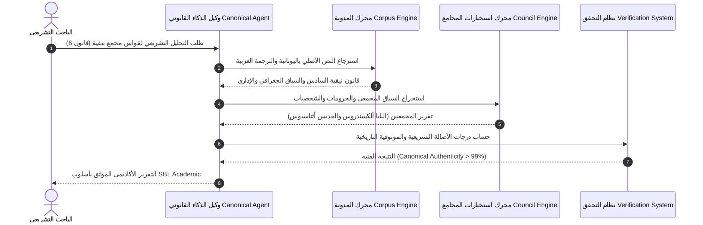
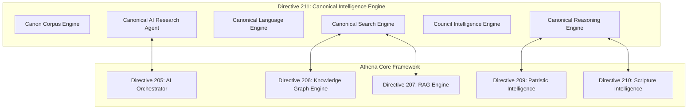

# محرك الذكاء الاصطناعي للقانون الكنسي والمعرفة المجتمعية (ATHENA X CANON ENGINE v1.0)

## 1. الرؤية الهندسية والمعمارية (System Architecture & Vision)

يمثل **محرك ATHENA X CANONICAL LAW & ECCLESIASTICAL KNOWLEDGE INTELLIGENCE ENGINE v1.0** النواة الأكاديمية التشريعية المتخصصة في تحليل ونقد ومقارنة وتوثيق القوانين الكنسية والمجامع المسكونية والمكانية والقرارات السنودسية عبر التقاليد الكنسية التاريخية: **الرومية البيزنطية، القبطية الأرثوذكسية، السريانية، الكاثوليكية، والشرقية القديمة**.

---

## 2. المخططات المعمارية ومخططات التدفق (Mermaid Architecture Diagrams)

### 1. المعمارية الهيكلية للنظام (Canonical Architecture)

### 2. خط المدى الزمني للمجامع المسكونية (Ecclesiastical Council Timeline Flow)

### 3. تدفق نقل وتوثيق القوانين الكنسية (Canon Transmission Flow)

### 4. معمارية تكامل الذكاء الاصطناعي (AI Integration Architecture)

---

## 3. الوحدات الفرعية للنظام (Subsystem Specifications)

1. **Canonical Domain Model:** دعم كافة القوانين والمجموعات التشريعية والمجامع والتقاليد الكنسية الكبرى باللغات الأصلية (يونانية، لاتينية، قبطية، سريانية، عربية).
2. **Canon Corpus Engine:** استيراد وفهرسة وتنظيم القوانين الكنسية والمراسيم والنوموكانون وتتبع الشواهد المخطوطية.
3. **Council Intelligence Engine:** بناء خطوط المدى الزمني للمجامع المسكونية والمكانية، خريطة القرارات والحرومات، وتحديد الشخصيات والسياق اللاهوتي.
4. **Canonical Search Engine:** البحث الهجين (BM25 + Dense Vector + Knowledge Graph) والترتيب بدرجات السلطة التشريعية والموثوقية التاريخية.
5. **Canonical Language Engine:** التحليل الصرفي واللغوي وإعراب المصطلحات الكنسية (قانون، أناثيما، شيروتونيا، أوتوكفالية).
6. **Canonical Reasoning Engine:** مقارنة التقاليد التشريعية المختلفة وتحديد نقاط التوافق والتمايز والتعليل الأكاديمي.
7. **Canonical AI Agent:** وكيل إنتلجنس متكامل للذكاء الاصطناعي للأبحاث التشريعية والتوليف الأكاديمي.
8. **Canon Citation Engine:** التوثيق الأكاديمي القياسي (SBL Academic, Chicago, APA, MLA).
9. **Verification Engine:** حساب درجات الأصالة التشريعية والأدلة التاريخية والمخطوطية.
