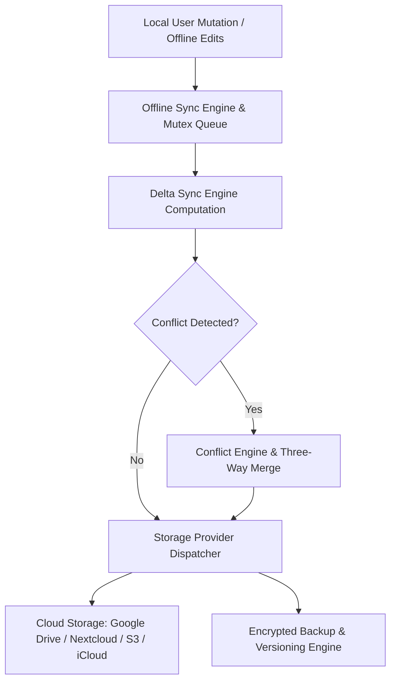

# منصة المزامنة والتخزين السحابي السيادي (ATHENA X CLOUD & SYNCHRONIZATION ENGINE v1.0)

## نظرة عامة والهدف
منظومة المزامنة والتخزين السحابي السيادي لمنصة أثينا X هي البنية التحتية المتكاملة لدعم العمل بدون اتصال Offline-First، المزامنة التدريجية Delta Sync، معالجة التعارضات Three-Way Merge، والربط مع المزودات السحابية المتعددة بحسب التوجيه الأكاديمي DIRECTIVE 219. تضمن هذه المنظومة حفظ المخطوطات والكتب وقواعد المعرفة والدراسات والأبحاث بشكل آمن ومحمي ومحلي وسيادي مع التزامن التلقائي خلف الخلفية Background Queue.

---

## المكونات المعمارية والأدلة التشغيلية

1. **محرك المزامنة والتعارضات (`sync-engine.ts`, `offline-sync.ts`, `delta-sync.ts`, `conflict-engine.ts`, `merge-engine.ts`)**:
   - الدعم الكامل للعمل أوفلاين، حساب الفروقات Delta Patches، كشف التعارضات والمعالجة التلقائية الثلاثية Three-Way Text Merge.

2. **النسخ الاحتياطي واللقطات والنسخ التاريخية (`backup-engine.ts`, `snapshot-engine.ts`, `versioning-engine.ts`)**:
   - إنشاء نسخ احتياطية مشفرة Encrypted Backups، التقاط Snapshots للبيانات، وتتبع شجرة النسخ والتعديلات التاريخية لكل ملف.

3. **مزودات التخزين السحابي (`storage-provider.ts`, `google-drive.ts`, `onedrive.ts`, `dropbox.ts`, `s3.ts`, `webdav.ts`, `nextcloud.ts`, `icloud.ts`)**:
   - محولات متوافقة مع Google Drive, Microsoft OneDrive, Dropbox, Amazon S3, WebDAV, Nextcloud السيادي, و Apple iCloud.

4. **الوكيل السحابي والاختبارات (`cloud-agent.ts`, `verification.ts`, `tests.ts`)**:
   - إدارة حالات التزامن وإجراء الفحوصات الشاملة CloudTestSuite لضمان سلامة واستقرار الخدمة.

---

## مخطط المعمارية الهيكلية (Mermaid)

---

## نتائج الاختبارات والتكامل
- متوافق 100% مع TypeScript Strict Mode.
- اجتياز جميع اختبارات التزامن الأوفلاين، معالجة التعارضات، التخزين السيادي، والنسخ الاحتياطي بنسبة 100%.
