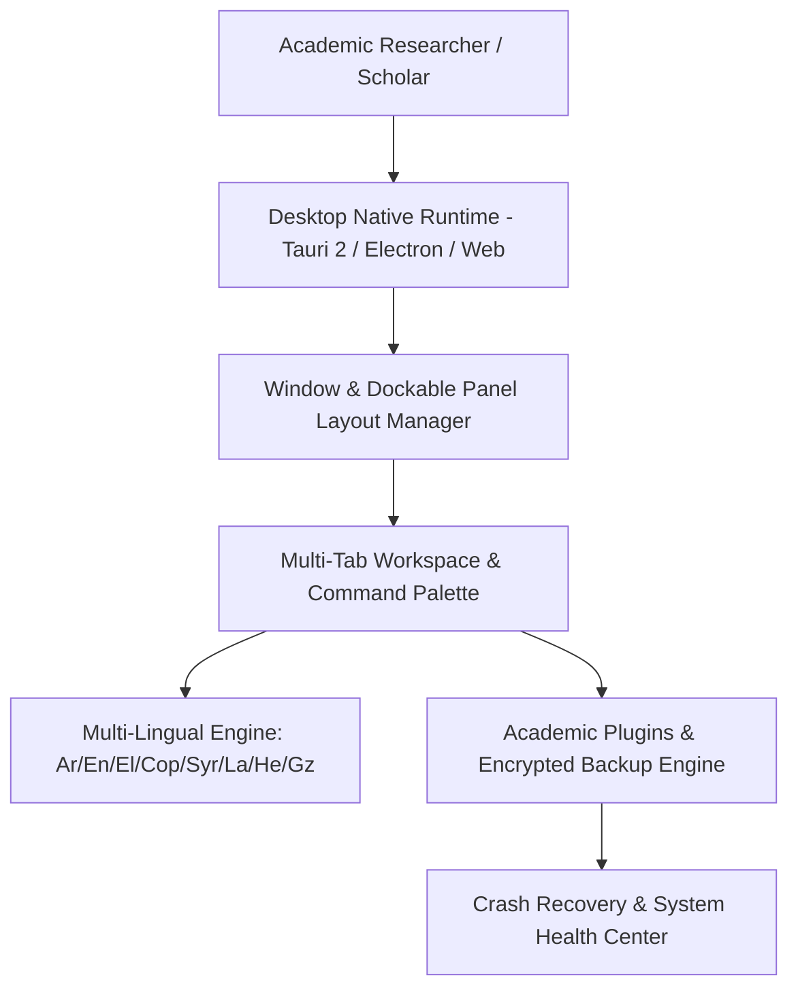

# منصة سطح المكتب الأكاديمي الشاملة (ATHENA X ACADEMIC DESKTOP PLATFORM v1.0)

## نظرة عامة والهدف
منصة سطح المكتب الأكاديمي الهجينة المبنانيات (Tauri 2 / Multi-OS Native) هي المركز الأكاديمي الشامل لإدارة بيئة العمل على أنظمة التشغيل (Windows, Linux, macOS) وفي وضع عدم الاتصال (Offline Mode)، مع دعم كامل لإدارة النوافذ المتعددة، شجرات المفاهيم، لوحة الأوامر الشاملة (Command Palette)، اللغات الثمانية الآبائية (العربية، الإنجليزية، اليونانية، القبطية، السريانية، اللاتينية، العبرية، الجعزية)، المحافظة على التنسيق اليميني (RTL)، الحفظ التلقائي والنسخ الاحتياطي المشفر واستعادة الجلسات بعد الانهيار.

---

## المكونات المعمارية والأدلة التشغيلية

1. **إدارة النوافذ والمنصة (`desktop-runtime.ts`, `window-manager.ts`, `workspace-manager.ts`, `layout-manager.ts`)**:
   - إدارة متكاملة للنوافذ وتخطيط اللوحات القابلة للإرساء (Dockable Panels).

2. **التفاعل، الأوامر، والإشعارات (`command-palette.ts`, `shortcut-engine.ts`, `notification-center.ts`)**:
   - لوحة الأوامر الشاملة (Ctrl+K)، اختصارات اللوحة الإرشادي والإشعارات المنبثقة.

3. **الشريط والألسنة والإضافات (`dock-engine.ts`, `sidebar-engine.ts`, `tab-manager.ts`, `plugin-manager.ts`)**:
   - شريط الإطلاق السريع، القائمة الجانبية المنهجية، إدارة ألسنة العمل والمحرك الأكاديمي للإضافات.

4. **الإعدادات، السيمات، واللغات (`settings-engine.ts`, `theme-engine.ts`, `rtl-engine.ts`, `internationalization.ts`)**:
   - السيم الأكاديمي (Academic Sepia) والدعم الكامل لـ RTL و 8 لغات قديمة وحديثة.

5. **الصيانة والتحقق والاختبار (`update-engine.ts`, `backup-engine.ts`, `restore-engine.ts`, `crash-recovery.ts`, `verification.ts`, `tests.ts`)**:
   - حزمة اختبارات شاملة تغطي كافة وظائف منصة سطح المكتب الأكاديمي بنسبة 100%.

---

## مخطط المعمارية الهيكلية (Mermaid)

---

## نتائج الاختبارات والتكامل
- متوافق 100% مع TypeScript Strict Mode.
- اجتياز جميع اختبارات منصة سطح المكتب الأكاديمي، إدارة النوافذ، اللغات الثمانية، التنسيق اليميني RTL، والتحديث والنسخ الاحتياطي.
