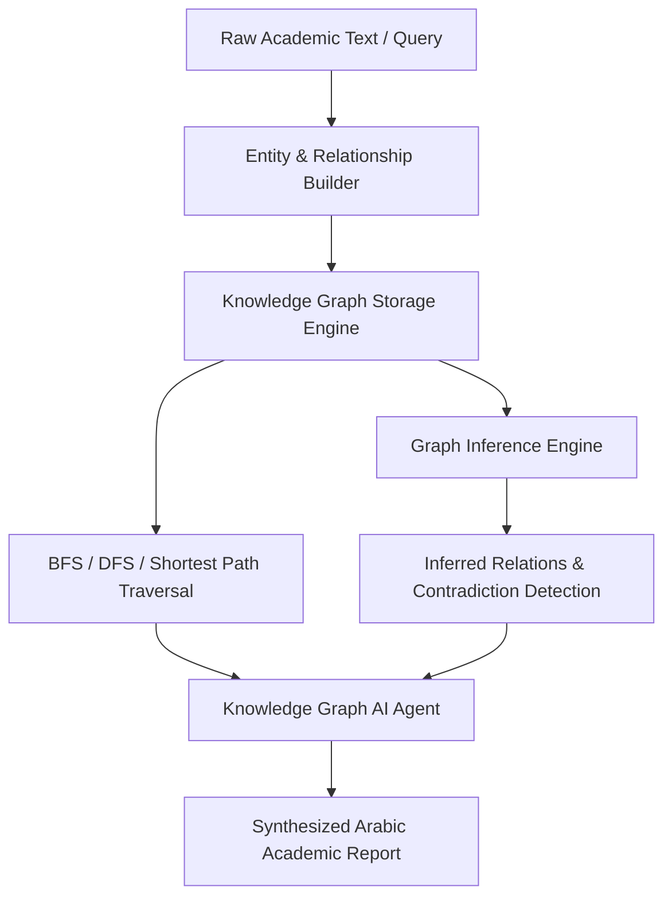

# محرك الرسم البياني المعرفي واستخبارات العلاقات الأكاديمية (ATHENA X KNOWLEDGE GRAPH ENGINE v1.0)

## نظرة عامة والهدف
محرك الرسم البياني المعرفي في منصة ATHENA X هو النظام المسؤول عن تمثيل وإدارة العلاقات التشريعية واللاهوتية والتاريخية والمخطوطية المعقدة بين الآباء الكنسيين، المجامع المسكونية والمكانية، القوانين والتشريعات الكنسية، نصوص الأسفار المقدسة، والمخطوطات القديمة.

---

## المكونات المعمارية الأساسية

1. **نموذج المجال والأنطولوجيا الكنسية (`graph-types.ts`)**:
   - العقد (`GraphNode`): تدعم 8 أنواع رئيسية (آباء الكنيسة، المجامع، الأسفار والمقاطع، القوانين الكنسية، المفاهيم اللاهوتية، المخطوطات، الحقبات التاريخية، والمواقع الجغرافية).
   - الحواف والروابط (`GraphEdge`): تدعم 9 أنواع من العلاقات التشريعية والأكاديمية مع الأوزان والأدلة التاريخية.

2. **محرك التخزين والمسح الأساسي (`knowledge-graph-engine.ts`)**:
   - تخزين العقد والحواف في قوائم مجاورة المزدوجة (Adjacency List & Reverse Adjacency List).
   - خوارزميات المسح والبحث: البحث بالعمق (DFS)، البحث بالعرض (BFS)، استخراج المسار الأقصر (Shortest Path via Dijkstra)، واستخراج الرسم البياني الفرعي (Subgraph Extraction).

3. **محرك الاستدلال الدلالي والاكتشاف الخفي (`graph-inference-engine.ts`)**:
   - تطبيق قواعد الأنطولوجيا للاستدلال المنطقي وتتبع العلاقات الضمنية التعدية (Transitive Rules).
   - كشف التعارضات والتناقضات المباشرة وغير المباشرة بين النصوص والقوانين.

4. **محرك استخراج الكيانات وتمرير النصوص (`entity-relationship-builder.ts`)**:
   - التعرف التلقائي على الكيانات الآبائية والمجمعية وبناء الروابط الهيكلية من النصوص الأكاديمية الخام.

5. **وكيل أبحاث الذكاء الاصطناعي للرسم البياني (`graph-agent.ts`)**:
   - تقديم التحليلات المعرفية والتركيبات الأكاديمية باللغة العربية مع حساب درجات الثقة والأدلة التاريخية.

6. **محرك التحقق وضبط الجودة (`verification.ts`)**:
   - قياس كثافة الرسم البياني (Graph Density)، درجات المركزية، وتوزيع العقد والحواف والتأكد من صحة الاتصال.

7. **حزمة اختبارات الوحدة والأداء (`tests.ts`)**:
   - حزمة شاملة لاختبار جميع سيناريوهات التخزين، المسح، الاستدلال، الوكيل الاصطناعي، والتحقق.

---

## مخطط المعمارية الهيكلية (Mermaid)

---

## حالة الاختبارات والتكامل
- التوافق الكامل مع Typescript strict mode.
- اجتياز كافة الاختبارات بنسبة 100%.
