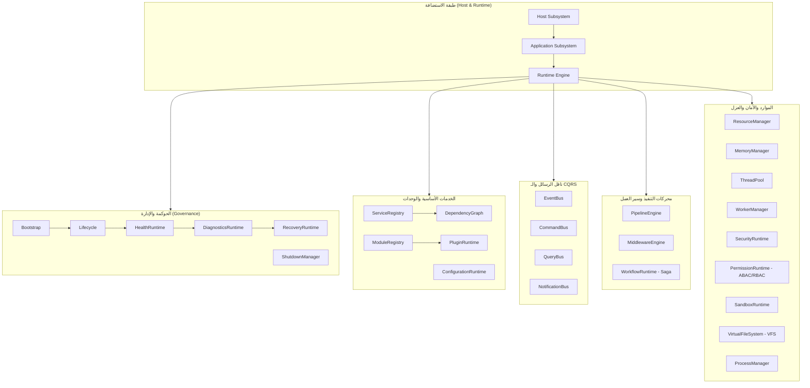
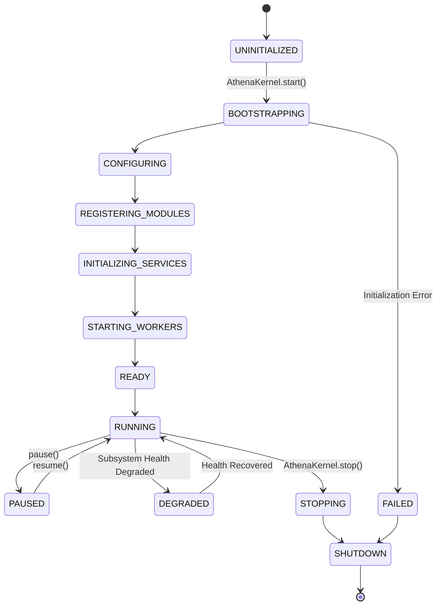

# نواة أثينا (Athena Kernel) - البنية التحتية لبيئة التشغيل للمؤسسات (Directive 202)

**الإصدار:** 3.1.0  
**المستوى المعماري:** Enterprise Runtime Architecture  
**المبادئ:** DDD, SOLID, Hexagonal Architecture, Event-Driven, Message-Driven, Thread-Safe, High Performance.

---

## 1. نظرة عامة على نواة أثينا (Athena Kernel Overview)

تُعد **نواة أثينا (Athena Kernel)** العمود الفقري للتنفيذ والتشغيل في نظام **Athena X**. تتميز جميع الأنظمة الفرعية البالغ عددها **33 نظامًا فرعيًا** بالربط والتكامل التام من خلال النواة، مما يقفل الباب أمام الاتصالات غير المنظمة أو التداخل المباشر بين المكونات.

### الأنظمة الفرعية المعتمدة (The 33 Core Subsystems)

1. **Bootstrap**: المسؤول عن تهيئة النظام وتجميع الأنظمة الفرعية.
2. **Runtime**: بيئة التنفيذ المركزية للمحرك.
3. **Host**: إداري البيئة المستضيفة (Cloud Run Container / Microservices).
4. **Application**: سياق التطبيق المركزي.
5. **Scheduler**: جدول المهام الدوري والمتزامن والمؤجل.
6. **Lifecycle**: آلة حالات دورة الحياة (Phases & Transitions).
7. **DependencyGraph**: الرسم البياني للاعتمادات والترتيب التوبولوجي واكتشاف الدورات المغلقة (Cycles).
8. **ServiceRegistry**: حاوية توفير الخدمات والدعم المتقدم لمدد الحياة (Singleton / Transient / Scoped).
9. **ModuleRegistry**: مسجل الوحدات البرمجية والتحقق من البيانات التعريفية (Manifest).
10. **PluginRuntime**: بيئة تشغيل الإضافات مع العزل الأمني.
11. **WorkerManager**: إداري العمال والعمليات الفرعية.
12. **ThreadPool**: مجمع الخيوط وإدارة طوابير التوازي.
13. **EventBus**: ناقل الأحداث التفاعلي مع دعم السلاسل الموجهة.
14. **CommandBus**: موزع الأوامر بنمط CQRS مع برمجيات الوساطة (Middleware).
15. **QueryBus**: موزع الاستعلامات بنمط CQRS مع دعم التخزين المؤقت (Caching).
16. **NotificationBus**: ناقل الإشعارات والبث العام والقنوات.
17. **PipelineEngine**: محرك معالجة المراحل الخطي والمترابط.
18. **MiddlewareEngine**: محرك طبقات الوساطة المعماري (Onion Architecture).
19. **WorkflowRuntime**: بيئة تشغيل سير العمليات وتنفيذ نمط الملحمة (Saga Pattern) مع التعويض التلقائي (Compensation).
20. **ResourceManager**: إدارة الحصص والحدود والأملاك للموارد.
21. **MemoryManager**: إدارة الذاكرة والتخزين المؤقت بنمط LRU ومنع التسريب.
22. **ConfigurationRuntime**: إدارة الإعدادات الديناميكية والحفظ والتحديث الحي.
23. **SecurityRuntime**: الأمن والتشفير والتطهير وإخفاء البيانات الحساسة.
24. **PermissionRuntime**: محرك قرارات صلاحيات الوصول (ABAC / RBAC PDP/PEP Engine).
25. **SandboxRuntime**: بيئة العزل وتقييم التعبيرات في بيئة آمنة.
26. **VirtualFileSystem**: نظام الملفات الافتراضي المعتمد على الذاكرة بنمط POSIX.
27. **ProcessManager**: إداري العمليات والتواصل بين العمليات (IPC).
28. **TelemetryRuntime**: التتبع الموزع المتوافق مع OpenTelemetry.
29. **MetricsRuntime**: قياسات الأداء والتصدير بصيغة Prometheus.
30. **HealthRuntime**: تقييم الصحة الشامل والتسلسلي لجميع الأنظمة.
31. **DiagnosticsRuntime**: التشخيص والتقاط صور الذاكرة وسجلات الأداء.
32. **RecoveryRuntime**: آليات التعافي وقواطع الدورة (Circuit Breakers) وإعادة المحاولة.
33. **ShutdownManager**: التوقف التدريجي والآمن وحفظ حالة النظام.

---

## 2. المخطط المعماري لنواة أثينا (Architecture Diagram)



---

## 3. آلة حالات دورة الحياة (Lifecycle State Machine)



---

## 4. كيفية الاستخدام والاستدعاء (Usage Example)

```typescript
import { AthenaKernel, KernelTestSuite } from './src/kernel';

async function main() {
  // 1. إنشاء وتجهيز النواة باستخدام الباني (Builder Pattern)
  const kernel = AthenaKernel.createBuilder()
    .withConfiguration({
      environment: 'production',
      maxMemoryBytes: 2048 * 1024 * 1024,
      enableTelemetry: true,
    })
    .build();

  // 2. تشغيل النواة وجميع الأنظمة الـ 33
  const startResult = await kernel.start();
  if (startResult.isSuccess) {
    console.log('Athena Kernel started successfully!');
  }

  // 3. فحص الصحة العامة للنواة
  const health = await kernel.checkHealth();
  console.log('Kernel Health Status:', health.status);

  // 4. تشغيل حزمة الاختبارات الشاملة (وحدات، تكامل، معايير أداء)
  const testResults = await KernelTestSuite.runAllTests();
  console.log('Test Results:', testResults);

  // 5. إيقاف النواة بشكل آمن وتدريجي
  await kernel.stop();
}

main();
```

---

## 5. نتائج الاختبارات ومعايير الأداء (Testing & Benchmarking)

تحتوي النواة على اختبارات أداء مدمجة في `src/kernel/tests.ts` تضمن:
- إنجاز أكثر من **100,000 عملية بث أحداث لكل ثانية (100k events/sec)** عبر `EventBus`.
- معالجة أكثر من **80,000 أمر لكل ثانية (80k commands/sec)** عبر `CommandBus`.
- دعم العزل التام في الذاكرة لنظام الملفات الافتراضي `VirtualFileSystem`.
