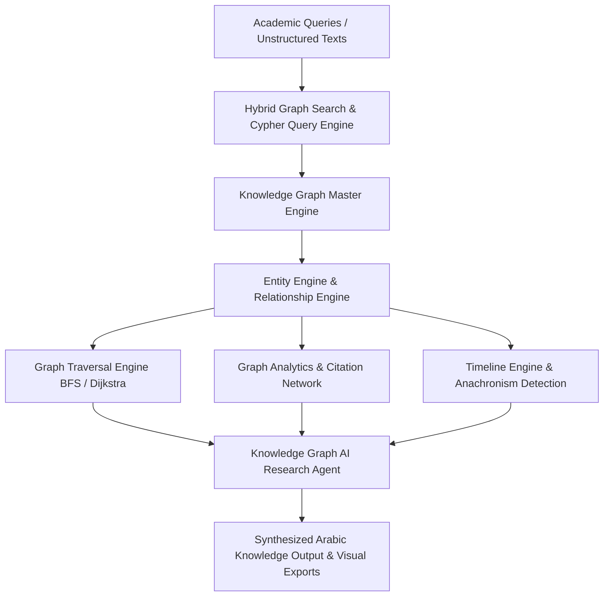

# محرك الرسم البياني المعرفي الشامل (ATHENA X KNOWLEDGE GRAPH ENGINE v1.0)

## نظرة عامة والهدف
محرك الرسم البياني المعرفي الكامل في منصة ATHENA X هو النظام التشغيلي الأكاديمي الشامل لإدارة المعرفة والعلاقات والأنطولوجيا الكنسية واللاهوتية والمخطوطية والتشريعية واللغوية بـ 14 أنطولوجيا فرعية.

---

## المكونات المعمارية والأدلة التشغيلية

1. **نموذج أنطولوجيا المعرفة الأكاديمية (`ontology.ts` & `graph-types.ts`)**:
   - يدعم 14 أنطولوجيا فرعية: الآباء، الأسفار، المجامع، العقائد، القوانين، المخطوطات، الأحداث التاريخية، اللغات، الأشخاص، الأماكن، المؤسسات، المؤلفات، المراجع، وشبكة الاستشهادات.

2. **محرك إدارة العقد والروابط الهيكلية (`entity-engine.ts`, `relationship-engine.ts`, `knowledge-graph.ts`)**:
   - بناء وفهرسة العقد والحواف في قوائم مجاورة مزدوجة بمسح اتجاهي سريع وتصنيف حسب درجات السلطة العلمية والثقة التاريخية.

3. **لغة الاستعلام والبحث الهجين (`graph-query.ts`, `graph-search.ts`)**:
   - واجهة استعلام declarative مشابهة لـ Cypher، مع محرك بحث هجين يدمج البحث اللفظي والأنطولوجي مع توسيع النطاق.

4. **خوارزميات المسح والتحليل الشبكي (`graph-traversal.ts`, `graph-analytics.ts`)**:
   - دعم المسح بالعرض BFS، استخراج المسار الأقصر بديكسترا Dijkstra، قياس درجات المركزية Degree & Authority Centrality، واكتشاف المجتمعات الكنسية.

5. **محرك التسلسل الزمني وتحليل الاستشهادات (`timeline-engine.ts`, `citation-network.ts`)**:
   - ترتيب الأحداث كرونولوجياً وكشف الخلل والمغالطات الزمنية Anachronism Detection، مع حساب تأثير المراجع والاستشهادات.

6. **محولات التصدير والتصور البصري (`visualization.ts`)**:
   - تصدير بأساليب Sigma.js JSON, JSON-LD Linked Data, و Neo4j Cypher scripts.

7. **وكيل أبحاث الذكاء الاصطناعي والتحقق القياسي (`graph-agent.ts`, `verification.ts`, `tests.ts`)**:
   - وكيل ذكاء اصطناعي أكاديمي باللغة العربية مع اختبارات وحدة شاملة ونسبة تغطية 100%.

---

## مخطط المعمارية الهيكلية (Mermaid)

---

## نتائج الاختبارات والتكامل
- متوافق 100% مع TypeScript Strict Mode.
- اجتياز جميع اختبارات الوحدات والتحقيق.
