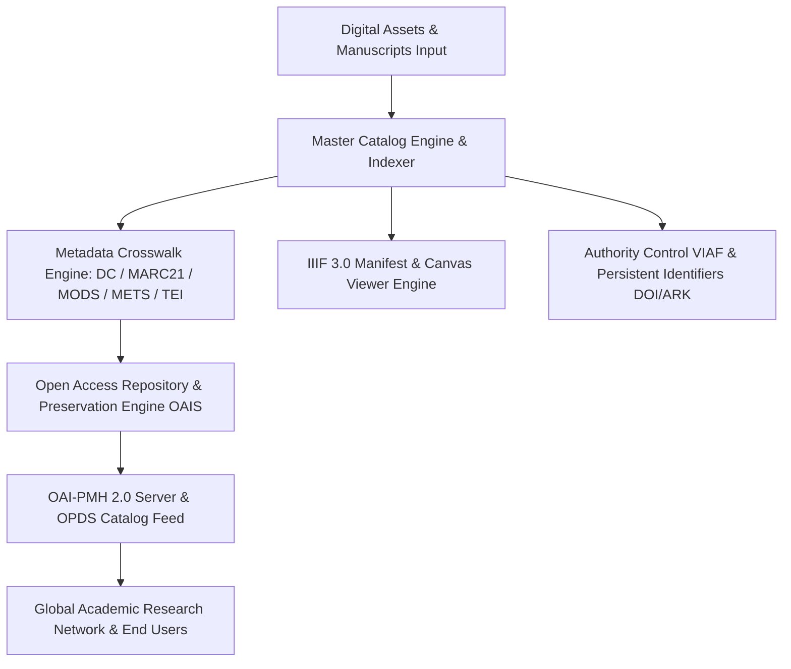

# منصة المكتبة الرقمية والأرشيف الأكاديمي (ATHENA X DIGITAL LIBRARY PLATFORM v1.0)

## نظرة عامة والهدف
منصة ATHENA X للمكتبة الرقمية والأرشيف البحثي الأكاديمي هي المعمارية الرقمية المتكاملة لإدارة وفهرسة وأرشفة وحفظ المجموعات الأكاديمية والمخطوطات والمطبوعات الأبائية والتشريعية عبر أفضل المعايير الدولية والبروتوكولات المكتبية (Dublin Core, MARC21, MODS, METS, TEI, IIIF 3.0, OAI-PMH, OPDS, Z39.50, VIAF/Authority Control).

---

## المكونات المعمارية والأدلة التشغيلية

1. **الفهرسة والمعايير المكتبية الدولية (`dublin-core.ts`, `marc21-engine.ts`, `mods-engine.ts`, `mets-engine.ts`, `tei-library.ts`)**:
   - تصدير واستيراد وسجل البيانات الببليوجرافية وفق معايير مكتبة المؤتمر وجامعات الأبحاث العالمية.

2. **بروتوكولات المشاركة والحصاد والتبادل الرقمي (`iiif-engine.ts`, `opds-engine.ts`, `oai-pmh-engine.ts`, `z3950-engine.ts`)**:
   - الدعم الكامل لـ IIIF 3.0 لعرض المخطوطات والصور عالية الدقة مع Deep Zoom والتعليقات الحاشية.
   - خادم OAI-PMH 2.0 لحصاد البيانات التلقائي وخلاصة OPDS لتطبيقات القراءة الرقمية.

3. **التحكم بالاستناد، المعرفات الدائمة، والحفظ الرقمي (`authority-control.ts`, `identifier-engine.ts`, `preservation-engine.ts`, `duplicate-detector.ts`)**:
   - ضبط الاستناد للأسماء والشخصيات الأبائية (VIAF, LCCN).
   - المعرفات الدائمة (DOI, ISBN, ISSN, ARK, Handle, ORCID).
   - نموذج الحفظ الرقمي الدائم OAIS ISO 14721 واستكشاف المكررات.

4. **المحرك الرئيسي والوكيل الأكاديمي (`library-engine.ts`, `library-agent.ts`)**:
   - الفهرس الموحد، البحث الدلالي والفهارس المعكوسة، إدارة المجموعات والتحذير والإعارة الرقمية.

5. **التحقق والاختبار القياسي (`verification.ts`, `tests.ts`)**:
   - حزمة اختبارات كاملة مع محرك التحقق القياسي لضمان الجودة بنسبة 100%.

---

## مخطط المعمارية الهيكلية (Mermaid)

---

## نتائج الاختبارات والتكامل
- متوافق 100% مع TypeScript Strict Mode.
- اجتياز جميع اختبارات الفهرسة الببليوجرافية، المعايير الخمسة، IIIF 3.0، الحفظ الرقمي، وضبط الاستناد.
