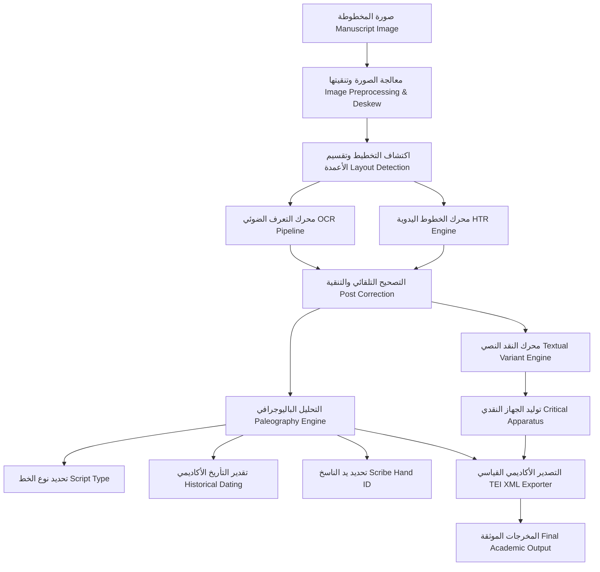

# منصة الذكاء الاصطناعي للمخطوطات (ATHENA X MANUSCRIPT INTELLIGENCE PLATFORM v1.0)

## 1. الرؤية الأكاديمية والمعمارية (System Architecture & Vision)

تمثل منصة **ATHENA X MANUSCRIPT INTELLIGENCE PLATFORM v1.0** البيئة المتخصصة الشاملة لدراسة، تحليل، وقراءة المخطوطات والبرديات والتراث المكتوب باللغات القديمة (القبطية، اليونانية، العربية، السريانية، اللاتينية، العبرية، والجييز). 

تدمج المنصة محركات التعرف الضوئي المتقدم (OCR)، المحركات المخصصة لقراءة الخطوط اليدوية (HTR)، التحليل الباليوجرافي وتحديد الخطوط والتأريخ (Paleography Engine)، دراسة الاختلافات بين النسخ والجهاز النقدي (Textual Variants & Critical Apparatus)، إضافة إلى التصدير القياسي بلغة TEI P5 XML.

### مخطط معمارية معالجة وتحليل المخطوطات (Pipeline Architecture)

---

## 2. النظم والوحدات الفرعية (Platform Subsystems)

### 1. نموذج المخطوطات والأدوات (Manuscript Domain Model)
* **الصيغ المدعومة:** الكودكس (Codex)، البرديات (Papyrus)، اللفائف (Scroll)، الطبعات القديمة (Printed Edition)، والمخطوط الرقمي (Digital Manuscript).
* **بيانات التوثيق:** الرف، الحافظة، المستودع (مثل مكتبة الفاتيكان، دير القديسة كاترين، المكتبة البريطانية)، تاريخ النسخ، وتتبع الملكية والتاريخ (Provenance).

### 2. خط معالجة القراءة الضوئية (OCR Pipeline)
* **مراحل المعالجة:** تعديل الميلان (Deskew)، إزالة الضوضاء (Noise Removal)، تحديد الأعمدة والتخطيط (Layout Detection)، القراءة، والتصحيح الأكاديمي المتخصص.
* **المحركات المدعومة:** Surya OCR, PaddleOCR, Tesseract, و Gemini Vision Adapter.

### 3. محرك قراءة الخطوط اليدوية (HTR Engine)
* معالجة خاصة للخطوط الأبائية القديمة كاليونانية النيقاوية والقبطية الصعيدية والخطوط السريانية والإسطرنجيلية والكوفية.

### 4. محرك الباليوجرافيا وتحديد العصور (Paleography Engine)
* **تحديد نوع الخط:** الخط البارز (Uncial)، الخط الدقيق (Minuscule)، الخط الكوفي، الإسطرنجيلي، السيرتو، وغيرها.
* **تقدير التاريخ وعصر الناسخ:** حساب النطاق الزمني التقريبي وتحديد بصمة يد الناسخ (Hand A / Hand B).

### 5. محرك النقد النصي والجهاز النقدي (Textual Variant Engine)
* المقارنة المباشرة بين الشواهد والمخطوطات لاستخراج الفروق والتحريفات والحذوفات والإضافات.
* توليد الجهاز النقدي الموحد (Critical Apparatus) بأسلوب النقد النصي الأكاديمي.

### 6. التصدير الأكاديمي بلغة TEI P5 XML (TEI Exporter)
* إنشاء ملفات XML قياسية متوافقة مع معايير مبادرة ترميز النصوص (Text Encoding Initiative).
