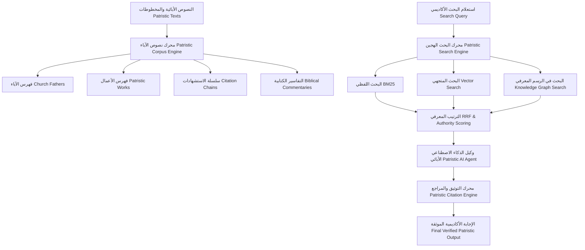
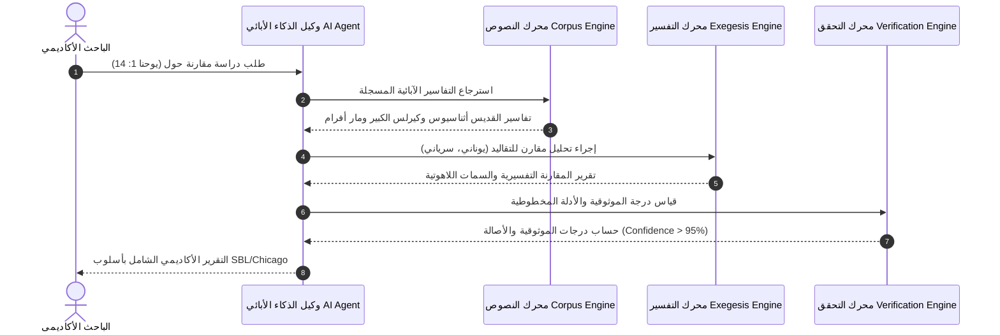
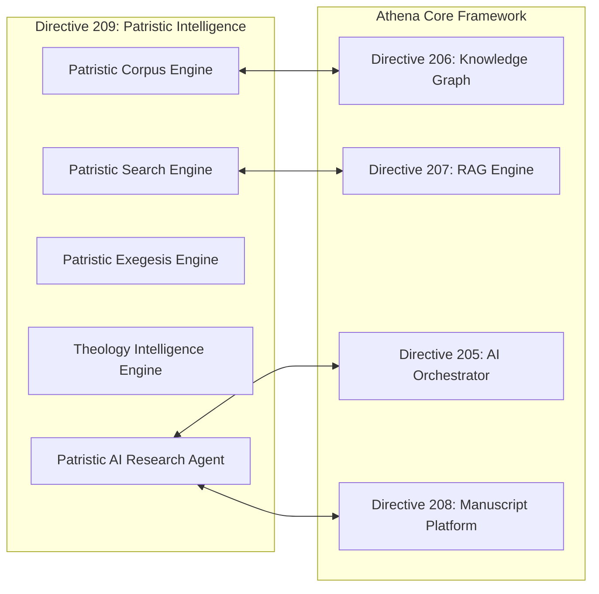

# محرك الذكاء الاصطناعي الأبائي واللاهوتي (ATHENA X PATRISTIC ENGINE v1.0)

## 1. الرؤية الهندسية والمعمارية (System Architecture & Vision)

يمثل **محرك ATHENA X PATRISTIC & THEOLOGICAL INTELLIGENCE ENGINE v1.0** النواة المتخصصة الأكاديمية لدراسة وتحليل ومعالجة النصوص الأبائية (Patristics)، التراث الكنسي، واللاهوت النقد مقارن. صُمم المحرك للتعامل الشامل مع التقاليد الآبائية الخمسة الرئيسية: **اليونانية (Greek Fathers)، اللاتينية (Latin Fathers)، السريانية (Syriac Fathers)، القبطية (Coptic Fathers)، والتراث المسيحي العربي (Arabic Patristic Tradition)**.

---

## 2. المخططات المعمارية ومخططات التدفق (Mermaid Architecture Diagrams)

### 1. معمارية المحرك الأبائي الكلية (Patristic Architecture)

### 2. تدفق البيانات والتحليل التفسيري (Data Flow & Exegesis Pipeline)

### 3. تكامل الذكاء الاصطناعي والشبكة المعرفية (AI Integration & Knowledge Graph Relations)

---

## 3. الوحدات الفرعية للنظام (Subsystem Specifications)

1. **Patristic Domain Model:** دعم النماذج الأكاديمية الصارمة لكبار الآباء والأعمال والمدونات الأبائية (PG, PL, Coptic, Syriac, Arabic).
2. **Patristic Corpus Engine:** استيراد، فهرسة، وبناء سلاسل الاستشهادات بين الآباء والأسفار الكتابية.
3. **Patristic Search Engine:** محرك البحث الهجين المستند إلى حساب درجات الأصالة التاريخية والموثوقية وسلطة الاستشهاد (Citation Authority Score).
4. **Patristic Exegesis Engine:** التفسير مقارن للأسفار القانونية الأولى والثانية ورصد التطور التاريخي للتفسير الأبائي.
5. **Theology & Council Intelligence:** توثيق قرارات المجامع المسكونية والمكانية والقوانين والرد على الهرطقات وتحديد المصطلحات (Homoousios, Theotokos).
6. **Patristic AI Agent:** وكيل إنتلجنس متكامل للذكاء الاصطناعي للتحليل والتجميع الأكاديمي.
7. **Patristic Citation Engine:** صياغة الهوامش والمراجع بحسب الأنظمة القياسية (SBL, Chicago, APA, MLA).
8. **Verification Engine:** حساب درجات الموثوقية الأكاديمية والدلائل المخطوطية.
