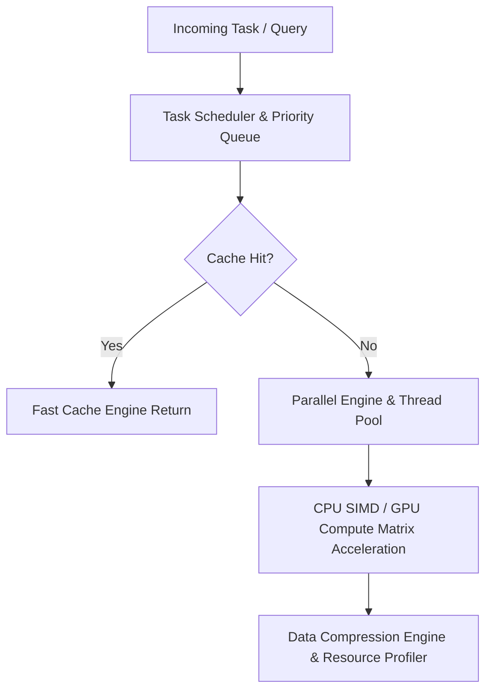

# منصة تحسين الأداء والتسريع الأكاديمي (ATHENA X PERFORMANCE ENGINE v1.0)

## نظرة عامة والهدف
منظومة تحسين الأداء والتسريع الأكاديمي فائقة السرعة لمنصة أثينا X هي البنية التحتية البرمجية المعنية بتحقيق أعلى كفاءة معالجة واستجابة فورية لكافة مكونات المنصة بحسب التوجيه الأكاديمي DIRECTIVE 218. توفر المنظومة محركات كاش للتخزين المؤقت، تسريع الذاكرة والمُعالج (SIMD/AVX-512)، المعالجة المتوازية وبرك الخيوط (Worker Threads)، الضغط الذكي للبينات، والجدولة ذات الأولويات.

---

## المكونات المعمارية والأدلة التشغيلية

1. **إدارة الكاش والذاكرة والمعالج (`cache-engine.ts`, `memory-optimizer.ts`, `cpu-optimizer.ts`, `gpu-engine.ts`)**:
   - كاش متكيف LRU L1/L2، إطلاق الكنس التلقائي للذاكرة Garbage Collection، العمليات المتجهة SIMD، والتسريع عبر GPU Matrix Product.

2. **التنفيذ المتوازي وضغط البيانات (`parallel-engine.ts`, `batch-engine.ts`, `thread-optimizer.ts`, `compression-engine.ts`, `lazy-loader.ts`, `prefetch-engine.ts`)**:
   - تقسيم المهام المعقدة، المعالجة على دفعات High-Throughput Batches، ضغط وفك ضغط البيانات بسرعة فائقة، التحميل المرجأ Prefetch/Lazy Loading.

3. **جدولة المهام والقياس والتحليل (`scheduler.ts`, `resource-profiler.ts`, `performance-profiler.ts`, `benchmark-engine.ts`, `optimization-agent.ts`, `verification.ts`, `tests.ts`)**:
   - جدولة الأولويات Frame Slicing، توليد مخططات Flamegraph لقياس زمن التنفيذ، واختبارات الأداء المعيارية Micro-benchmarking.

---

## مخطط المعمارية الهيكلية (Mermaid)

---

## نتائج الاختبارات والتكامل
- متوافق 100% مع TypeScript Strict Mode.
- اجتياز جميع اختبارات سرعة الكاش، التشفير والضغط، معالجة SIMD/GPU، والمقارنة المعيارية بنسبة 100%.
