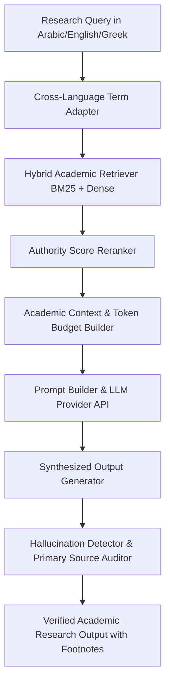

# محرك أبحاث الاسترجاع المعزز بالأدلة الأكاديمية (ATHENA X RAG ACADEMIC RESEARCH ENGINE v1.0)

## نظرة عامة والهدف
محرك ATHENA X RAG هو المعمارية الأكاديمية المتقدمة للبحث والتنقيب في النصوص الأبائية والكتابية والمخطوطات والمجامع المسكونية، مع توثيق الهوامش كشف الهلاوس الدلالية وتجميع الأدلة المصدرية.

---

## المكونات المعمارية والأدلة التشغيلية

1. **تقسيم وتجزيء النصوص الأكاديمية (`chunking.ts` & `rag-types.ts`)**:
   - دعم أربع استراتيجيات تجزيء: دلالي Semantic، نافذة منزلقة Sliding Window، هرمي Hierarchical، وتكيفي Adaptive.

2. **محرك التضمين المتعدد اللغات والبحث الهجين (`embeddings.ts`, `retriever.ts`, `retrieval.ts`)**:
   - تضمين كثيف Dense Vectors بـ 384 بعداً مع دمج تقييم BM25 وإعادة الترتيب Reranking بناءً على معامل الموثوقية الأكاديمية.

3. **التوثيق وصياغة السياق والاستشهاد (`citation-aware.ts`, `academic-context.ts`, `context-builder.ts`, `prompt-builder.ts`)**:
   - بناء السياق الأكاديمي الشامل مع إدارة الميزانية اللفظية Token Budget وتوليد الهوامش بأسلوب علمي دقيق.

4. **كشف الهلاوس والتحقق من المصادر (`source-verification.ts`, `hallucination-detector.ts`, `cross-language.ts`)**:
   - كشف ادعاءات الذكاء الاصطناعي ومطابقتها مع النصوص المصدرية ورسم الخرائط المصطلحية بين العربية واليونانية واللاتينية والقبطية.

5. **وكيل البحث والتحقق القياسي (`rag-agent.ts`, `verification.ts`, `tests.ts`)**:
   - وكيل بحث واستجابة أكاديمي ذكي مع حزمة اختبارات شاملة تغطي كافة وظائف النظام بنسبة 100%.

---

## مخطط المعمارية الهيكلية (Mermaid)

---

## نتائج الاختبارات والتكامل
- متوافق 100% مع TypeScript Strict Mode.
- اجتياز جميع اختبارات الاسترجاع والتوثيق والتحقيق.
