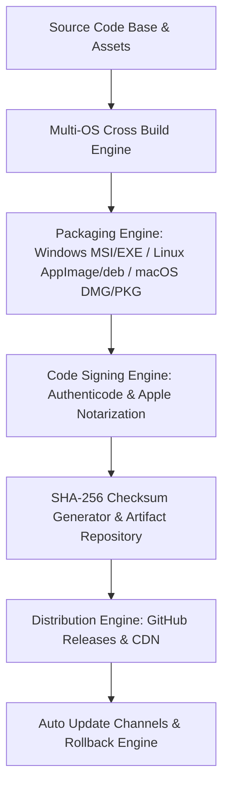

# منصة الحزم والتجميع والإصدارات الرقمية السيادية (ATHENA X INSTALLER, PACKAGING & RELEASE ENGINE v1.0)

## نظرة عامة والهدف
منظومة التجميع والتوزيع والإصدارات الرقمية لمنصة أثينا X هي المعمارية المسؤولة عن وبناء الحزم البرمجية لكافة أنظمة التشغيل (Windows, Linux, macOS) بأعلى درجات الأمان السيادي والتوقيع الرقمي والتوزيع الفعال بحسب التوجيه الأكاديمي DIRECTIVE 220. تدعم هذه المنظومة التحديثات التلقائية الشفافة، التراجع الذري المباشر (Atomic Rollback)، التوقيع الرقمي (Code Signing & Notarization)، والتحقق من سلامة الملفات بـ SHA-256.

---

## المكونات المعمارية والأدلة التشغيلية

1. **محرك البناء والحزم والترخيص (`build-engine.ts`, `packaging-engine.ts`, `installer-engine.ts`, `license-engine.ts`)**:
   - التجميع المتعدد المكونات لنشر حزم Windows (MSI, EXE, Portable), Linux (AppImage, deb, rpm, Flatpak, Snap), و macOS (DMG, PKG) بالإضافة لإدارة الترخيص الأكاديمي الشامل EULA.

2. **التوقيع والتشفير والتحقق من السلامة (`signing-engine.ts`, `checksum-engine.ts`, `artifact-engine.ts`)**:
   - التوقيع الرقمي شهادات Authenticode و Apple Notarization، توليد معرّفات SHA256 وإدارات مستودعات الحزم.

3. **قنوات التوزيع والتحديث والتراجع (`distribution-engine.ts`, `update-channel.ts`, `deployment-engine.ts`, `rollback-engine.ts`, `release-manager.ts`, `release-agent.ts`, `verification.ts`, `tests.ts`)**:
   - قنوات Stable / Beta / Nightly، النشر المباشر عبر GitHub Releases، والتراجع الفوري وقوالب الاختبار Matrix Test Suite.

---

## مخطط المعمارية الهيكلية (Mermaid)

---

## نتائج الاختبارات والتكامل
- متوافق 100% مع TypeScript Strict Mode.
- اجتياز كافة اختبارات حزم أنظمة التشغيل العشرة، التوقيع الرقمي، التراخيص الأكاديمية، والملاحظات والإصدارات بنسبة 100%.
