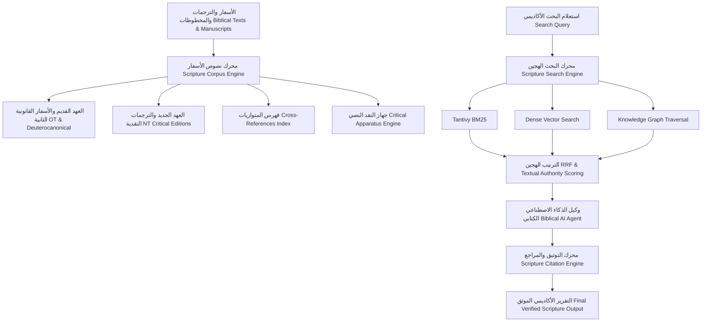
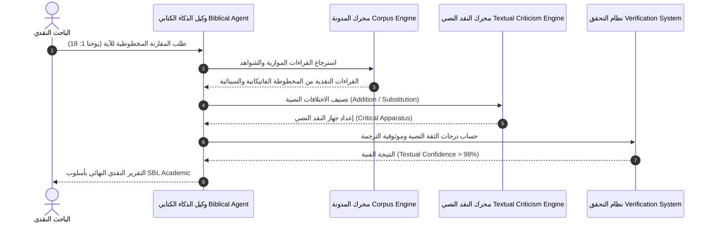
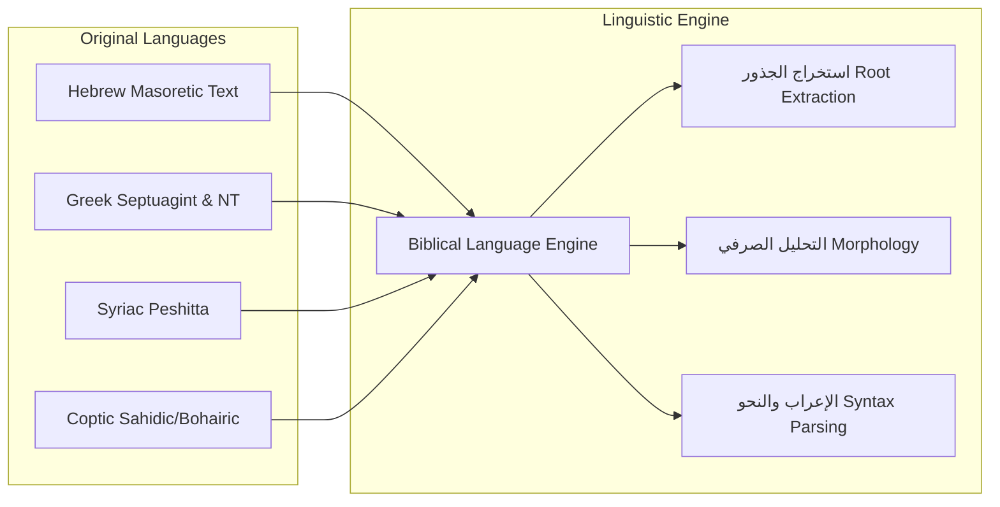
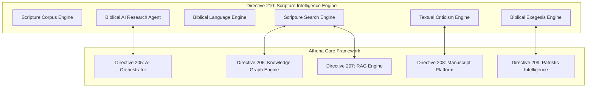

# محرك الذكاء الاصطناعي للنصوص والأسفار الكتابية (ATHENA X SCRIPTURE ENGINE v1.0)

## 1. الرؤية الهندسية والمعمارية (System Architecture & Vision)

يمثل **محرك ATHENA X BIBLICAL SCRIPTURE INTELLIGENCE ENGINE v1.0** النواة الأكاديمية المتخصصة في تحليل ونقد ومعالجة الأسفار الكتابية القانونية الأولى والثانية باللغات الأصلية: **العبرية (Hebrew Masoretic Text)، اليونانية (Septuagint & Critical Greek Text)، السريانية (Peshitta)، القبطية (Coptic Sahidic/Bohairic)، اللاتينية (Vulgate)، والترجمات العربية والأوروبية المعاصرة**.

---

## 2. المخططات المعمارية ومخططات التدفق (Mermaid Architecture Diagrams)

### 1. معمارية محرك الأسفار الكتابية (Scripture Architecture)

### 2. تدفق انتقال النصوص والنقد النصي (Text Transmission & Critical Apparatus Flow)

### 3. تدفق مقارنة المخطوطات واللغات الأصلية (Manuscript & Linguistic Comparison Flow)

### 4. معمارية تكامل الذكاء الاصطناعي (AI Integration Architecture)

---

## 3. الوحدات الفرعية للنظام (Subsystem Specifications)

1. **Biblical Domain Model:** دعم كافة الأسفار والأسفار القانونية الثانية واللغات القديمة (عبرية، يونانية، سريانية، قبطية، لاتينية، عربية).
2. **Scripture Corpus Engine:** استيراد وفهرسة وتربيط المتوازيات والشواهد المخطوطية والجداول النقدية.
3. **Biblical Search Intelligence:** البحث الهجين (BM25 + Vector + Graph) مع الترتيب بحسب درجات السلطة النصية والمخطوطات والأبائيات.
4. **Biblical Language Intelligence:** استخراج الجذور والتحليل الصرفي والإعراب الأكاديمي لكافة اللغات الكتابية.
5. **Exegesis & Interpretation Engine:** ربط الآيات مع نصوص الآباء والمجامع والحرومات اللاهوتية (بالتكامل مع Directive 209).
6. **Textual Criticism Engine:** بناء جهاز النقد النصي (Critical Apparatus) وتصنيف الاختلافات النصية.
7. **Biblical AI Agent:** وكيل إنتلجنس متكامل للذكاء الاصطناعي للبحث والتحليل والتجميع الأكاديمي.
8. **Scripture Citation Engine:** التوثيق الأكاديمي القياسي (SBL, Chicago, APA, MLA).
9. **Verification Engine:** حساب درجات الموثوقية النصية والأدلة المخطوطية.
