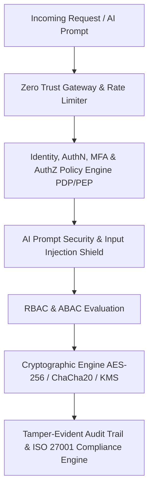

# منصة الأمان الشاملة والتحقق الصفري (ATHENA X SECURITY & ZERO TRUST PLATFORM v1.0)

## نظرة عامة والهدف
منظومة الأمان والتحقق الصفري (Zero Trust & Defense in Depth) لمنصة أثينا X هي البنية الأمنيّة السيادية المتكاملة بحسب التوجيه الأكاديمي DIRECTIVE 217. توفر هذه المنظومة حماية متعددة الطبقات لكافة مكونات المنصة والنواة والذكاء الاصطناعي ومحرّك RAG والملفات والمخطوطات، مع التشفير السيادي (AES-256-GCM, ChaCha20, RSA, ECC, SHA-3, Argon2id)، إدارة الهويات، التحكم بالوصول المبني على الأدوار والخصائص (RBAC/ABAC)، حماية نماذج الذكاء الاصطناعي من حقن التعليمات (Prompt Injection Protection)، سجلات المراجعة غير القابلة للتعديل، والتوافق مع المعايير الدولية ISO 27001 و NIST SP 800-53.

---

## المكونات المعمارية والأدلة التشغيلية

1. **التحقق الصفري والهويات والتحكم بالوصول (`zero-trust.ts`, `identity-engine.ts`, `authentication.ts`, `authorization.ts`, `rbac.ts`, `abac.ts`, `policy-engine.ts`, `permission-engine.ts`)**:
   - مبدأ "لا تثق بأحد مطلقاً، تحقق دائماً" مع نماذج RBAC/ABAC وتقييم السياسات PDP/PEP.

2. **الخزينة والشفريات وإدارة المفاتيح (`credential-store.ts`, `secret-manager.ts`, `crypto-engine.ts`, `key-management.ts`, `certificate-engine.ts`, `secure-storage.ts`)**:
   - الخزينة المشفرة، محرك KMS، الشهادات الرقمية PKI، التدوير التلقائي للمفاتيح، وتشفير البيانات المستقرة.

3. **المراجعة، التوافق، والسلامة (`audit-engine.ts`, `compliance-engine.ts`, `integrity-engine.ts`, `tamper-detection.ts`)**:
   - سجلات الأحداث الأمنية غير القابلة للتلاعب، التوافق مع ISO 27001، والتحقق من سلامة البيانات والأشجار الرقمية Merkle Trees.

4. **حماية التطبيق، الشبكة، والرزم (`sandbox-security.ts`, `network-security.ts`, `rate-limiter.ts`, `csrf-engine.ts`, `xss-protection.ts`, `sql-injection.ts`, `content-security.ts`)**:
   - بيئة البيزل المعزولة للإضافات، حماية TLS 1.3، حد معدل الطلبات، الدروع الأمنية ضد CSRF/XSS/SQLi و CSP.

5. **أمان الذكاء الاصطناعي والتحقق الشامل (`prompt-security.ts`, `security-agent.ts`, `verification.ts`, `tests.ts`)**:
   - جدار الحماية ضد حقن التعليمات (Prompt Injection Guard)، الوكيل الأمني الشامل، وحزمة اختبارات SecurityTestSuite.

---

## مخطط المعمارية الهيكلية (Mermaid)

---

## نتائج الاختبارات والتكامل
- متوافق 100% مع TypeScript Strict Mode.
- اجتياز جميع اختبارات منظومة الأمان والتحقق الصفري، التشفير السيادي، حماية حقن التعليمات، والمراجعة بنسبة 100%.
