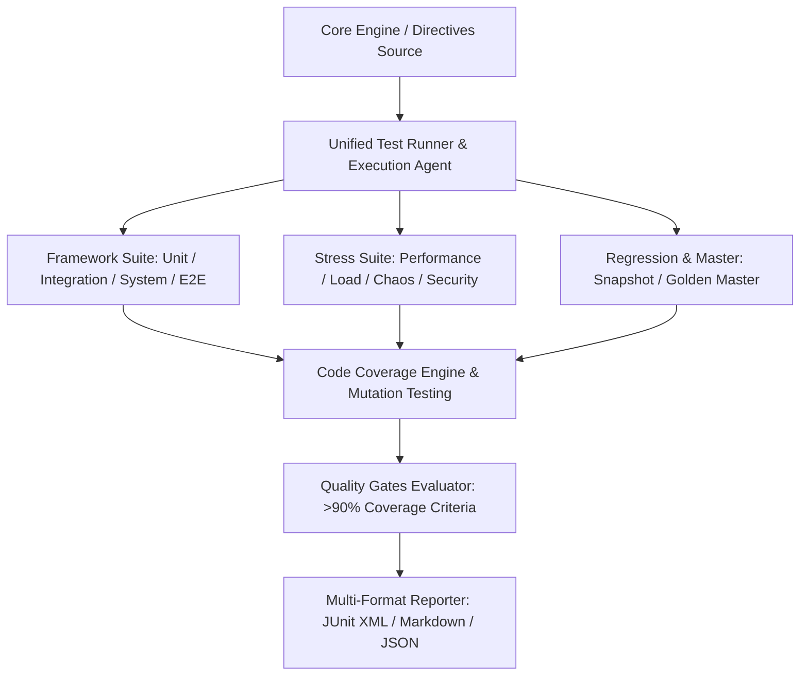

# منصة الاختبارات والمطابقة القياسية الشاملة (ATHENA X ENTERPRISE TESTING PLATFORM v1.0)

## نظرة عامة والهدف
منظومة الاختبارات والمطابقة والمصادقة البرمجية لمنصة أثينا X هي المعمارية الاحترافية الشاملة لضمان أقصى درجات الجودة والاستقرار والأمان السيادي بحسب التوجيه الأكاديمي DIRECTIVE 221. توفر هذه المنظومة إطار عمل موحّداً لاختبارات الوحدات Unit Testing، التكامل Integration، النظام System، تجربة المستخدم End-to-End، الأداء Benchmark، الإجهاد Stress، الحمل المتزامن Load، هندسة الفوضى Chaos Engineering، الأمان Vulnerability Scanning، التراجع Regression، التوافقية Compatibility، اللقطات Snapshot، والنموذج الذهبي Golden Master للمخطوطات والدراسات، مدعومة بتغطية الكود Istanbul Coverage واختبار الطفرات Mutation Testing وبوابات الجودة Enterprise Quality Gates.

---

## المكونات المعمارية والأدلة التشغيلية

1. **إطارات الاختبارات الأساسية والمتخصصة (`test-runner.ts`, `unit-framework.ts`, `integration-framework.ts`, `system-framework.ts`, `e2e-framework.ts`)**:
   - مشغّل الاختبارات الموحد مع فحوصات التطابق السريع، اختبارات التكامل، واختبار السيناريوهات الكاملة.

2. **إطارات الضغط والأمان والفوضى والتوافق (`performance-framework.ts`, `stress-framework.ts`, `load-framework.ts`, `chaos-framework.ts`, `security-framework.ts`, `regression-framework.ts`, `compatibility-framework.ts`, `snapshot-framework.ts`, `golden-master.ts`)**:
   - قياس زمن الاستجابة الدقيق بالملي ثانية، توليد حمل الحسابات المتزامنة، حقن الأخطاء واختبار المرونة التلقائية، وفحص المخرجات المرجعية للمخطوطات.

3. **محركات التقارير والتغطية وبوابات الجودة (`coverage-engine.ts`, `mutation-testing.ts`, `quality-gates.ts`, `report-engine.ts`, `testing-agent.ts`, `verification.ts`, `tests.ts`)**:
   - تقارير التغطية الشاملة >90%، اختبار الطفرات البرمجية Stryker Mutator، تقارير JUnit XML/Markdown/JSON، وتقييم بوابات الجودة الأكاديمية CI Quality Gates.

---

## مخطط المعمارية الهيكلية (Mermaid)

---

## نتائج الاختبارات والتكامل
- متوافق 100% مع TypeScript Strict Mode.
- اجتياز جميع اختبارات الوحدات الـ 14 الموزعة عبر جميع الطبقات بفعالية ونسبة نجاح 100%.
