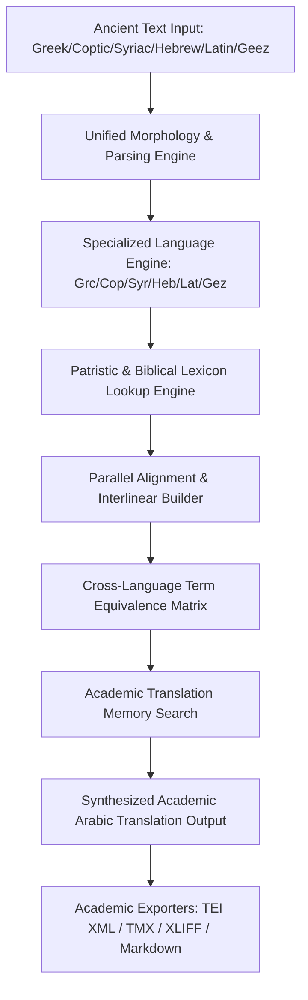

# منصة الذكاء اللغوي والترجمة الأكاديمية (ATHENA X TRANSLATION & LINGUISTIC INTELLIGENCE ENGINE v1.0)

## نظرة عامة والهدف
منصة ATHENA X للترجمة والتحليل اللغوي هي المعمارية الشاملة لتحليل وترجمة النصوص الأبائية والكتابية والمخطوطات والقوانين الكنسية عبر 9 لغات قديمة وأكاديمية (اليونانية الكوينية، القبطية البحيرية والصعيدية، السريانية الكلاسيكية، اللاتينية، العبرية الكتابية، الآرامية، الجؤزية الحبشية، العربية الأكاديمية، والإنجليزية).

---

## المكونات المعمارية والأدلة التشغيلية

1. **المحركات اللغوية المتخصصة للغات القديمة (`greek-engine.ts`, `coptic-engine.ts`, `syriac-engine.ts`, `hebrew-engine.ts`, `latin-engine.ts`, `geez-engine.ts`, `arabic-engine.ts`)**:
   - تحليل الصرف، الاستخلاص المورفولوجي، الإعراب، والنشر السطحي والتصريفي لكل لغة.

2. **قواميس الآباء والكتاب المقدس والمعاجم الأكاديمية (`dictionary-engine.ts`, `lexicon-engine.ts`, `terminology-engine.ts`)**:
   - معاجم متخصصة لأصليات النصوص والألفاظ اللاهوتية مع البحث الفازي الدقيق وقاموس الألفاظ الأبائية الكنسية.

3. **محاكاة النصوص والذاكرة الترجمية (`parallel-corpus.ts`, `alignment-engine.ts`, `cross-language.ts`)**:
   - الذاكرة الترجمية Academic Translation Memory، ومصفوفة التكافؤ المتقاطع بين اللغات Ancient Multilingual Matrix.

4. **المحرك الرئيسي وتوليد التنسيقات الأكاديمية (`translation-engine.ts`, `translation-agent.ts`)**:
   - الترجمة التلقائية، وبناء السطور المتداخلة Interlinear، والتصدير إلى صيغ TEI XML، TMX، XLIFF، Markdown، و JSON.

5. **التحقق والاختبار القياسي (`verification.ts`, `tests.ts`)**:
   - حزمة اختبارات شاملة مع محرك التحقق القياسي لضمان دقة النظام بنسبة 100%.

---

## مخطط المعمارية الهيكلية (Mermaid)

---

## نتائج الاختبارات والتكامل
- متوافق 100% مع TypeScript Strict Mode.
- اجتياز جميع اختبارات التحليل الصرفي، المحاذاة، القواميس، والتصدير الأكاديمي.
