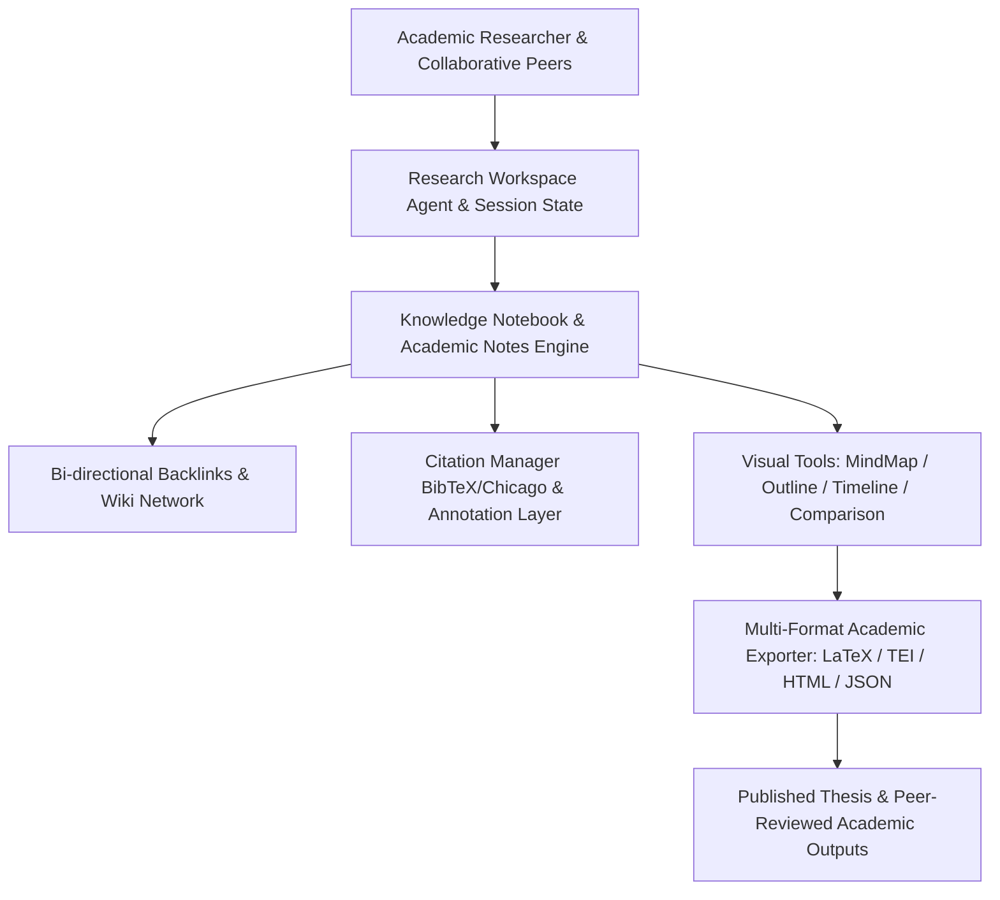

# بيئة البحث العلمي ودفتر الملاحظات الأكاديمي (ATHENA X RESEARCH WORKSPACE & KNOWLEDGE NOTEBOOK v1.0)

## نظرة عامة والهدف
بيئة العمل البحثية ودفتر الملاحظات المعرفي الذكي هي المركز الأكاديمي الشامل لإنشاء وإدارة المشاريع البحثية، تدوين الملاحظات المترابطة (Zettelkasten & Wiki Backlinks)، المراجع الببليوجرافية (BibTeX/Chicago)، التظليل والتعليق الحاشي، وشجرات المفاهيم والجداول المقارنة والتصدير لمختلف الصيغ الأكاديمية (LaTeX, TEI P5, HTML, JSON, Markdown).

---

## المكونات المعمارية والأدلة التشغيلية

1. **إدارة المشاريع ودفاتر الملاحظات (`project-manager.ts`, `academic-notes.ts`, `knowledge-notebook.ts`)**:
   - تدوين الملاحظات مع الدعم الكامل لـ LaTeX Math والمعادلات الرياضية والوصلات الخلفية المزدوجة Backlinks.

2. **المراجع، الحواشي، والتظليل (`citation-manager.ts`, `annotation-engine.ts`, `highlight-engine.ts`, `tagging-engine.ts`)**:
   - تصدير المراجع بصيغ BibTeX و Chicago.
   - التعليقات الحاشية والتظليل الملون.

3. **أدوات التخطيط والتحليل البصري (`outline-engine.ts`, `mindmap-engine.ts`, `timeline-workspace.ts`, `comparison-workspace.ts`)**:
   - إنشاء هيكل الرسالة العلمية Outline، الخرائط الذهنية Mind Maps، الخط الزمني التاريخي Timeline، والمصفوفات المقارنة.

4. **إدارة القراءة والمهام والتعاون والتصدير (`reading-list.ts`, `task-manager.ts`, `export-engine.ts`, `collaboration-engine.ts`)**:
   - متابعة قائمة القراءات ونسب الإنجاز.
   - التصدير لمختلف الصيغ العلمية المعتمدة.

5. **التحقق والاختبار القياسي (`verification.ts`, `tests.ts`)**:
   - حزمة اختبارات شاملة تغطي كافة وظائف مساحة العمل بنسبة 100%.

---

## مخطط المعمارية الهيكلية (Mermaid)

---

## نتائج الاختبارات والتكامل
- متوافق 100% مع TypeScript Strict Mode.
- اجتياز جميع اختبارات الملاحظات الأكاديمية، الوصلات الخلفية، المراجع، التصدير لـ LaTeX و TEI، والتكامل المعرفي.
